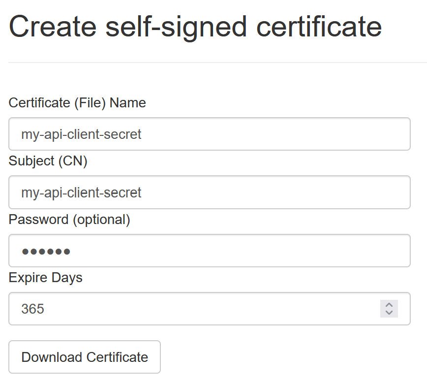
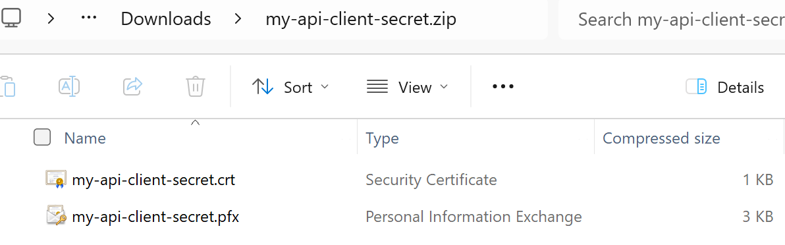

Selbst-signierte Zertifikate erstellen
======================================

**IdentityServerNET** bietet ein *Admin-Werkzeug* zum Erstellen von 
selbst-signierten Zertifikaten. Das Ergebnis ist ein *ZIP-File* mit folgendem 
Inhalt:

* **{cert-name}.pfx:** Das Zertifikat als PFX-Datei
* **{cert-name}.crt:** Der öffentliche Schlüssel des Zertifikats als CRT-Datei

.. note::

    CRT-Dateien können in einem Texteditor geöffnet werden und haben folgendes 
    Format:

    .. code::

        -----BEGIN CERTIFICATE-----
        MIICsDCCAZigAwIBAgIIHFgs7XAI8jgwDQYJKoZIhvcNAQELBQAwGDEWMBQGA1UEAxMNY2xpZW50
        LXNlY3JldDAeFw0yNDA4MjMwNTA0NThaFw0yNTA4MjMwNTA0NThaMBgxFjAUBgNVBAMTDWNsaWVu
        ...
        -----END CERTIFICATE-----

Ein häufiges Einsatzgebiet für ein selbst-signiertes Zertifikat ist die Verwendung als 
**Secret** für **Clients**.

Um ein Zertifikat zu erzeugen, wechselt man auf der *Admin-Seite* in den Bereich ``Create Certs``:

* **Certificate (File) Name:** Ein Name für das Zertifikat. Dieser entspricht dem Dateinamen
  des ZIP-Files und der einzelnen Dateien.

* **Subject (CN):** Das Subject für das Zertifikat (CN=...). Dieser Name erscheint im Zertifikat.

* **Password:** Ein optionales Passwort für das Zertifikat. Die PFX-Datei lässt sich später nur 
  mit diesem Passwort öffnen.

* **Expire Days:** Die Anzahl der Tage, nach denen dieses Zertifikat abläuft.

Klickt man auf ``Download Certificate``, wird eine ZIP-Datei mit folgendem Inhalt 
heruntergeladen:

