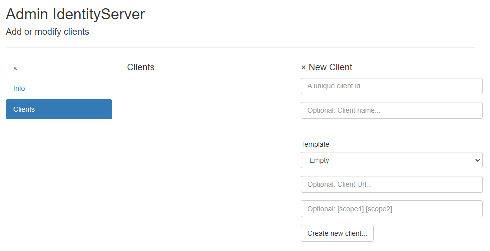

Clients verwalten
=================

Clients sind Anwendungen, die sich über den IdentityServer anmelden können. Folgende Anwendungstypen können dabei unterschieden werden:

* **Web-Anwendung:** Eine Web-Anwendung, bei der sich Anwender mit Benutzername und Passwort anmelden müssen.
* **API Clients:** Anwendungen, die auf eine (Web-)API zugreifen müssen, die einen gültigen *Bearer Token* verlangt, der vom IdentityServer 
  ausgestellt wurde.
* **JavaScript Client:** Eine *Single Page Application* oder *statische Webseite*, bei der eine Anmeldung über Benutzername und Passwort erforderlich ist. 

Um Clients zu verwalten und zu erstellen, muss man als Administrator angemeldet sein. Im *Admin-Bereich* gibt es die Kachel ``Clients``, die zur
Ansicht ``Add or modify clients`` führt:

Von hier aus können neue Clients erstellt bzw. bestehende Clients verwaltet werden.

.. toctree::
   :maxdepth: 2
   :caption: Contents:

   webapp
   api

   

   