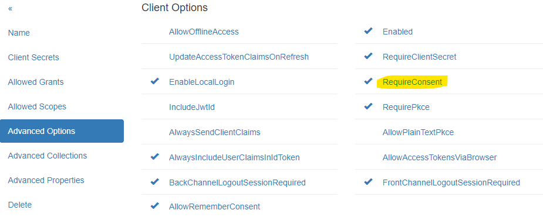
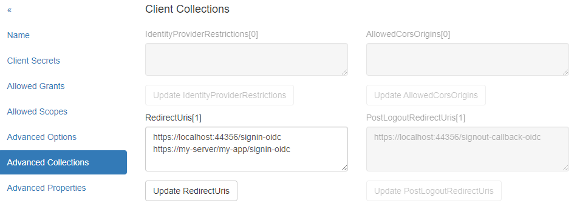

Web Anwendung
=============

Client erstellen/bearbeiten
---------------------------

Um einen neuen *Client* zu erstellen, muss eine eindeutige *Client Id* vergeben werden. 
Optional kann auch ein sprechender Name vergeben werden.

Damit nicht alles manuell eingegeben werden muss, sollte das Template ``WebApplication`` gewählt werden. 
Außerdem sollte für dieses Template die URL zur Web-Anwendung eingetragen werden. Die Eingabe der **Scopes** ist optional und kann 
auch im nächsten Schritt noch bearbeitet werden.

Mit ``Create new client...`` wird der neue Client erzeugt:

.. image:: img/webapp1.png

Nach erfolgreicher Erstellung des Clients gelangt man zur Seite ``Modify Client: ...``. Hier sind die 
verschiedenen Eigenschaften des Clients in Menüpunkten gegliedert:

``Name``:
+++++++++

.. image:: img/webapp2.png

Hier kann der sprechende Name für den Client geändert und eine Beschreibung eingetragen werden.

``Client Secrets``:
+++++++++++++++++++

Ein Client sollte auch ein **Secret** besitzen. Eine Client-Anwendung muss dieses **Secret** bei der Anmeldung mitschicken. Ein **Secret** kann sowohl ein 
Text (**Shared Secret**) als auch ein Zertifikat (**X509 Certificate *.crt**) sein. Ein **Shared Secret** kann auch im **Secrets Vault** gespeichert werden (siehe später).

Das **Shared Secret** kann ein beliebiger Text sein, eine Art Passwort. Möchte man ein sicheres **Secret** erzeugen, kann man den ``Random Secret Generator`` auf dieser Seite verwenden.

.. note:: 

    Ein **Secret** kann auch ein Ablaufdatum (``Optional Expiration Date``) und eine Beschreibung haben.

Das **Secret** sollte sicher sein. Für dieses Beispiel verwenden wir der Einfachheit halber das **Secret** mit dem Wert ``secret`` und ohne Ablaufdatum:

.. image:: img/webapp3.png

.. note::

    Es können mehrere **Secrets** angelegt werden. Ein Client muss dann genau ein *gültiges* **Secret** übergeben. Dies ist nützlich, wenn ein **Secret** ersetzt werden muss.
    Dabei kann das neue **Secret** neben dem alten **Secret** bestehen, bis alle Clients auf das neue **Secret** umgestellt sind. Erst dann kann das alte **Secret** gelöscht werden.

``Allowed Grants``:
+++++++++++++++++++

Hier können die **Grants** eingestellt werden, die für die Anmeldung erlaubt sind. Jede Anmeldungsmethode funktioniert mit unterschiedlichen **Grants**. Da beim Erstellen des 
Clients ``WebApplication`` als Template gewählt wurde, sollten hier bereits die passenden **Grants** eingestellt sein:

.. image:: img/webapp4.png

``Allowed Scopes``:
+++++++++++++++++++

Die **Scopes** geben an, welche **Identity Resources** die Web-Anwendung für einen angemeldeten User abfragen kann. Es dürfen nur **Scopes** eingetragen werden, die im 
**IdentityServerNET** als **Identity Resources** eingetragen sind (siehe Abschnitt Erste Schritte).

Für Web-Anwendungen sind hier standardmäßig ``openid`` und ``profile`` eingetragen:

.. image:: img/webapp5.png

``Advanced Settings``:
++++++++++++++++++++++

Hier können weitere Optionen angegeben werden, die für die Anmeldung verwendet werden. Beispielsweise kann festgelegt werden, ob ein **Secret** vom Client zwingend übergeben werden muss
(``RequireClientSecret``).
Über die Option ``RequireConsent`` kann gesteuert werden, ob ein User nach der Anmeldung noch zustimmen muss, dass die Web-Anwendung Zugriff auf die angeforderten **Scopes** (Claims) erhält:

``Advanced Collections``:
+++++++++++++++++++++++++

Hier können Auflistungen eingetragen werden, die für die Anmeldung notwendig sind. Bei einer Web-Anwendung ist insbesondere die URL der Seite wichtig, zu der nach erfolgreicher Anmeldung weitergeleitet wird (``RedirectUri``).
Möchte man hier mehrere URLs angeben, muss jede URL in einer neuen Zeile eingetragen werden:

Kommt die Anmeldeanforderung später von einer Seite, die hier nicht aufgelistet ist, lässt **IdentityServerNET** sie nicht zu.

``Advanced Properties``:
++++++++++++++++++++++++

Erweiterte Einstellungen für den Client, wie ``IdentityTokenLifetime``, ``AccessTokenLifetime`` usw. Diese Werte müssen in der Regel nicht geändert werden.

``Delete``:
+++++++++++

Hier kann ein Client auch wieder gelöscht werden.

Client Web-Anwendung anpassen
-----------------------------

Ein Client muss **OpenId Connect** unterstützen. Im ASP.NET Core-Umfeld werden hierfür die entsprechenden Methoden angeboten.

**IdentityServerNET** bietet dafür einen einfachen Weg über Erweiterungsmethoden des ``IServiceCollection``-Objekts an. Dazu muss folgendes **NuGet**-Paket installiert werden:

.. code:: powershell

    dotnet add package IdentityServerNET.Extensions.DependencyInjection

Über dieses Paket wird ``IServiceCollection`` um folgende Methode erweitert:

.. code:: csharp
    
    using IdentityServerNET.Extensions.DependencyInjection;

    var builder = WebApplication.CreateBuilder(args);

    // ...

    builder.Services.OpenIdConnectAuthentication(builder.Configuration);

Die Methode entnimmt die Parameter aus der App-Configuration (z. B. ``appsettings.json``). In der Konfiguration muss es einen Abschnitt ``OpenIdConnectAuthentication`` geben, in dem die notwendigen
Parameter enthalten sind.

.. note::

    Der Abschnittsname kann auch geändert werden. Dann muss der entsprechende Abschnitt anstelle von ``OpenIdConnectAuthentication`` übergeben werden.

.. code:: json

    {
        // ...
        "OpenIdConnectAuthentication": {
            "Authority": "https://localhost:44300",
            "ClientId": "my-client",
            "ClientSecret": "secret",
            "Scopes": "openid,profile"
        }
    }

