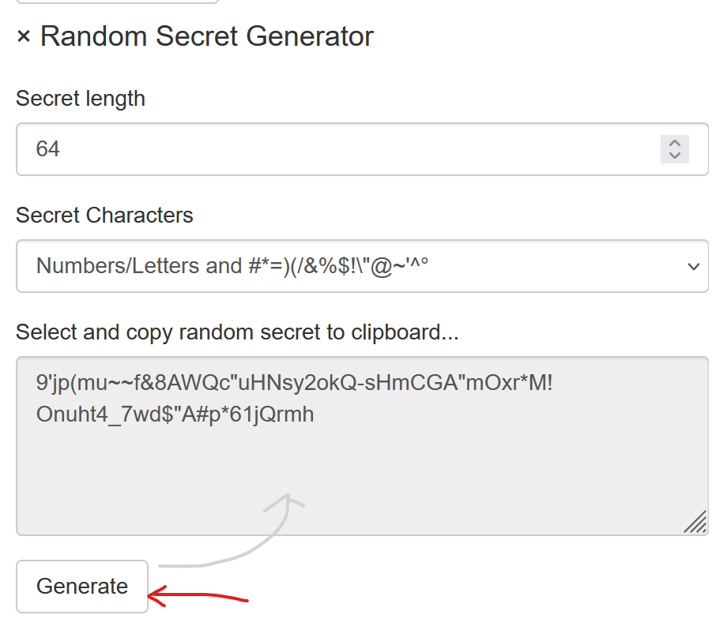

Secrets
=======

Um *Access Tokens* zu erhalten, muss oder sollte ein **Client** eine **Client Id** und ein 
**Client Secret** übergeben (**Client Id** und **Client Secret** entsprechen in etwa
*Benutzername* und *Passwort*).

Hier werden die unterschiedlichen Arten von **Secrets** aufgezeigt.

Kein Secret verwenden
---------------------

Es können **Clients** eingerichtet werden, die kein **Secret** voraussetzen. Unter dem Menüpunkt ``Advanced Options`` eines **Clients** 
gibt es die folgende Option:

.. image:: img/secrets1.png

Ist die Option ``RequireClientSecret`` nicht gesetzt, muss ein **Client** kein Secret übergeben.

.. note::

    Diese Option nicht zu setzen, sollte nur bei ``Web Anwendungen`` erfolgen. Hier können 
    unter dem Menüpunkt ``Advanced Collections`` noch ``Redirect Urls`` angegeben werden:

    .. image:: img/secrets2.png

    Da der Anmeldeprozess bei *OpenId Connect* nur möglich ist, wenn auf eine dieser URLs
    weitergeleitet werden kann, ist ein **Web Application Client** dadurch grundsätzlich 
    abgesichert. 

.. note::

    **API Clients** sollten niemals ohne **Secret** ein AccessToken abrufen können!

Shared Secrets
--------------

Die einfachste Art von Secrets sind ``Shared Secrets``. Dabei handelt es sich um 
Passwörter (Text):

.. image:: img/secrets3.png

.. note::

    Es können mehrere **Secrets** für einen **Client** angegeben werden. Ein **Client** 
    muss genau ein passendes **Secret** aus den hier angeführten übergeben.

.. note::

    **Secrets** können ein Ablaufdatum haben (``optional: Expire Date``). Das kann hilfreich sein,
    wenn ein Client nur für eine beschränkte Zeit Zugriff auf eine API haben soll.

Zum Erstellen von sicheren **Secrets** kann der ``Random Secret Generator`` verwendet werden,
der auf der Seite angeboten wird:

Ein so erzeugtes Passwort kann aus dem Textfeld kopiert und in der Eingabemaske für ein 
``Shared Secret`` eingefügt werden.

X509 Certificate
----------------

**Clients** können auch über Zertifikate abgesichert werden. Dazu können die im vorherigen Abschnitt
beschriebenen selbstsignierten Zertifikate verwendet werden.

Zum Absichern des **Clients** über ein Zertifikat sind folgende Dateien notwendig:

* **PFX-Datei:** Enthält den öffentlichen und privaten Schlüssel und kann optional mit einem 
  Passwort geschützt sein. Dieses Zertifikat verwendet der **Client**, um ein 
  *AccessToken* abzurufen.

* **CRT-Datei:** Öffentlicher Schlüssel (Textformat). Dieses Zertifikat wird am 
  *IdentityServerNET* als **Secret** hinterlegt.

Die *CRT-Datei* muss mit einem Texteditor geöffnet werden und der Inhalt in die Eingabemaske
kopiert werden. Als Typ für das **Secret** muss ``X509 Certificate (.crt)`` eingestellt werden.

Zugriff vom Client
++++++++++++++++++

Ein **Client** muss zuerst das Zertifikat auslesen:

.. code:: csharp

    var cert = new X509Certificate2(@"my-api-client-secret.pfx", "password");

Dieses Zertifikat kann dann an unterschiedliche Methoden aus dem **NuGet**-Paket 
``IdentityServerNET.Clients`` anstelle eines *Shared Secrets* übergeben werden.

.. code:: csharp

    var tokenClient = new IdentityServerNET.Clients.TokenClient("my-api-commands", cert);
    await tokenClient.GetAccessToken("https://localhost:44300", []);

    var accessToken = tokenClient.AccessToken;

Secrets Vault
-------------

Im **Secrets Vault** (siehe vorheriger Abschnitt) können **Secrets** zentral gespeichert werden.
Berechtigte **Clients** können **Secrets** über die **Secret Value API** abrufen.

Damit **Secrets** nicht an mehreren Stellen gepflegt werden müssen, können **Secrets** für
**Clients** direkt auf das **Secrets Vault** verweisen. Ändert man ein **Secret** im 
**Secrets Vault**, muss es nicht erneut bei den **Secrets** für den **Client** angepasst werden.

Anstelle des eigentlichen **Secrets** wird der *Pfad* des **Secrets** im **Secrets Vault** eingetragen:

.. image:: img/secrets6.png

Um den Pfad für ein Secret herauszufinden, wechselt man als Administrator ins
**Secrets Vault** und klickt auf die entsprechende Version eines **Secrets**. Im Browser
wird ein JSON angezeigt, in dem auch der korrekte Pfad für das **Secret** zu sehen ist:

.. image:: img/secrets7.png

.. note::

    Als Pfad kann eine bestimmte Version oder die letzte erstellte Version des Secrets verwendet
    werden. Dafür muss im Pfad die Versionsnummer einfach weggelassen werden, z. B.: 
    ``my-api-locker/db-connectionstring``

Zugriff vom Client
++++++++++++++++++

Der Zugriff auf das **Secrets Vault** wurde schon im Kapitel *Secrets Vault* beschrieben. 
Hier noch einmal das Beispiel, mit der Annahme, dass der **API Client** für die
**Secrets Vault API** mit einem Zertifikat abgesichert wurde.

Ein **Client** muss zuerst das Zertifikat auslesen:

.. code:: csharp

    var cert = new X509Certificate2(@"my-api-client-secret.pfx", "password");

Dieses Zertifikat kann dann an unterschiedliche Methoden aus dem **NuGet**-Paket 
``IdentityServerNET.Clients`` anstelle eines *Shared Secrets* übergeben werden.

.. code:: csharp

    var secretsVaultClient = new IdentityServerNET.Clients.SecretsVaultClient("my-api-secrets", cert);
    await secretsVaultClient.OpenLocker("https://localhost:44300", "my-api-locker");
    var secretResponse = await secretsVaultClient.GetSecret("db-connectionstring");

    Console.WriteLine(secretResponse.GetValue());

Auf diese Weise kann eine **Client-Anwendung** entwickelt werden, in deren Konfiguration
keine sensiblen Daten gespeichert werden müssen. Alle **Secrets** werden im **Secrets Vault**
gespeichert. Das einzige Geheimnis, das für den Client noch notwendig ist, ist das optionale
Passwort für das Zertifikat (dies kann theoretisch hart codiert werden).

Das Zertifikat kann regelmäßig ausgetauscht werden. Dafür sind folgende Schritte notwendig:

* Neues Zertifikat erstellen (eventuell mit dem gleichen Passwort)

* Für **Secrets Vault Client** den Inhalt der neuen CRT-Datei eintragen

* Für die **Client-Anwendung** das neue PFX-File aktualisieren

