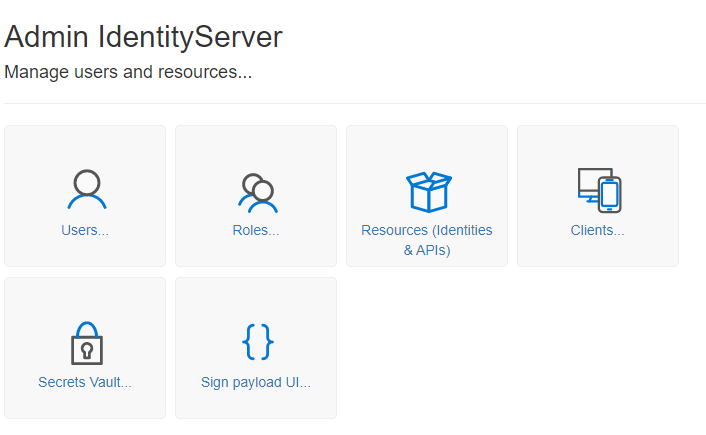
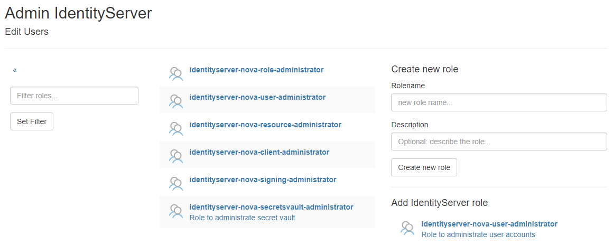
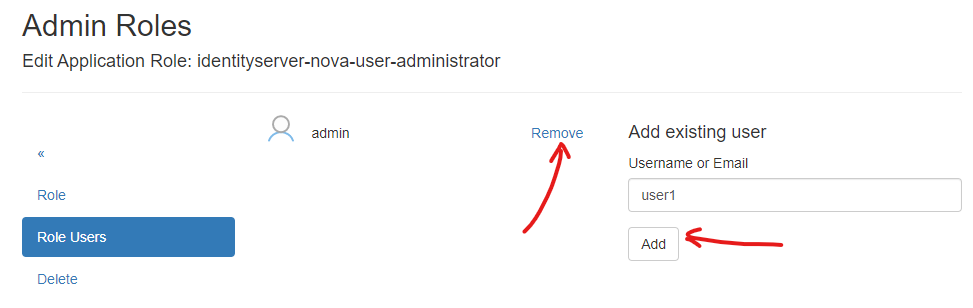
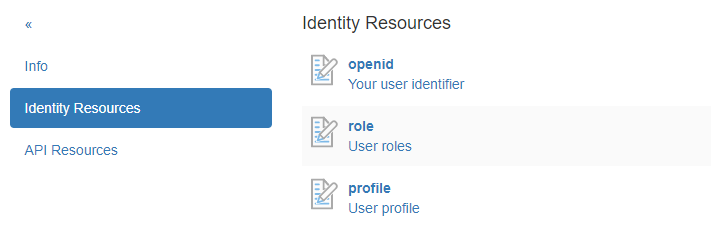

Administration des Servers
==========================

.. note::

    Hier wird nur die grundlegende Administration erläutert; auf spezielle Punkte (wie das Registrieren einer Webanwendung als Client, etc.) wird später genauer eingegangen.
    Ebenfalls wird nicht auf jede Administrationsseite eingegangen (z. B. ``User/Set Password``, ``User/Delete User``), da diese selbsterklärend sein sollten.

Klickt man als angemeldeter Administrator auf der Startseite auf die Kachel ``Admin``, gelangt man zur folgenden Anzeige:

User
----

Klickt man auf die Kachel ``User``, erscheint folgende Ansicht:

.. image:: img/admin-server2.png

.. note::

    Über das Symbol ``«`` im Menü gelangt man immer zur vorherigen Ansicht zurück.

.. note::

    Wurden bereits viele User angelegt, kann die Liste über einen Filter eingeschränkt werden. Dazu gibt man einen Filter (z. B. ``admin``)
    unter ``Filter users...`` ein und klickt auf ``Set Filter``. Damit werden nur User angezeigt, die ``admin`` im Namen haben. Leert man 
    das Eingabefeld wieder und klickt erneut auf ``Set Filter``, werden wieder alle User angezeigt.

Hier können durch Klick auf einen User in der Liste Eigenschaften aus dem Profil des Users administriert werden (Passwort, Name, Rollen).
Über ``Create new user`` kann auch ein neuer User angelegt werden.

.. note::

    Es wird empfohlen, hier als Username immer eine E-Mail-Adresse anzugeben. Diese sollte in der Regel eindeutig sein.

    Wenn der Username eine E-Mail-Adresse ist, sollte diese in der Regel (bei der Registrierung des Users) auch bestätigt werden. In der Testumgebung kann
    der Administrator diesen Schritt überspringen und die E-Mail-Adresse als bestätigt kennzeichnen:

    .. image:: img/admin-server3.png

    Eine spätere Anmeldung mit diesem User ist möglich, wenn die E-Mail-Adresse als ``confirmed`` markiert ist!
   

Rollen
------

Klickt man auf die Kachel ``Roles``, gelangt man zur folgenden Ansicht:

Hier können Rollen verwaltet werden, die Usern zugeordnet werden können. Standardmäßig werden hier Rollen des **IdentityServerNET** aufgelistet, die angeben, ob ein User
bestimmte Administrationstätigkeiten ausführen kann. Über den Bereich ``Create new role`` können benutzerdefinierte Rollen erstellt werden.

Klickt man auf eine Rolle in der Liste, können verschiedene Eigenschaften (wie die Beschreibung) geändert oder die Rolle gelöscht werden.

Zusätzlich können hier User einer Rolle zugeordnet oder aus einer Rolle entfernt werden:

Ressourcen (Identitäten & APIs)
-------------------------------

Klickt man auf die Kachel ``Resources (Identities & APIs)``, gelangt man zu einer Ansicht, in der erklärt wird, was ``Identity Resources`` und ``Api Resources`` sind.

Hier geht es im ersten Schritt um die ``Identity Resources``. Diese geben an, welche ``Claims`` eine Client-(Web-)Anwendung bei einer Anmeldung abfragen kann. 
Die Einstellungen hier beziehen sich auf den gesamten Server und geben an, was potenziell verfügbar ist. Später muss beim Einrichten eines Clients festgelegt werden,
welche ``Claims`` eine bestimmte Anwendung abfragen kann (``Scopes``). Es stehen dann nur die hier angegebenen ``Identity Resources`` zur Auswahl.

Wechselt man zum Punkt ``Identity Resources``, wird folgende Ansicht angezeigt:

.. image:: img/admin-server6.png

Hier können sowohl neue *Identity Resources* erstellt als auch *Standard Identity Resources* hinzugefügt werden. Für den Anfang sollten die 
*Standard Identity Resources* ``OpenId`` und ``Profile`` hinzugefügt werden. Soll eine Client-Anwendung später auch die ``Rollen`` des angemeldeten Nutzers sehen,
kann zusätzlich eine benutzerdefinierte *Identity Resource* ``role`` erstellt werden:

Klickt man auf eine *Identity Resource*, können weitere Angaben gemacht werden, beispielsweise der Name des ``Claims``:

.. image:: img/admin-server8.png

.. note::

    Bei benutzerdefinierten *Identity Resources* öffnet sich diese Seite beim Erstellen. Hier muss immer zuerst ein ``Claim``-Name vergeben werden.
