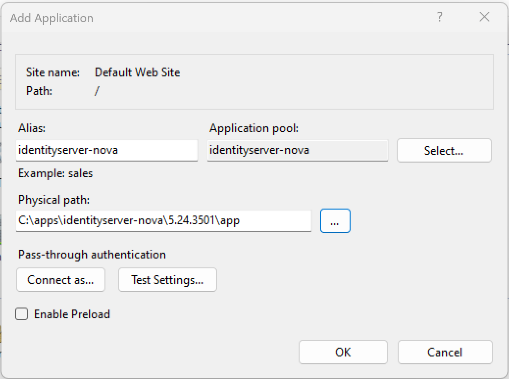

Installation unter Windows
==========================

.. note::

    Voraussetzung ist die Installation von ASP.NET Core 8.0. Gibt man in einer *Eingabeaufforderung*
    ``dotnet --info`` ein, muss folgendes Framework in der Ausgabe vorhanden sein:

    .. code::

        .NET runtimes installed:
        Microsoft.AspNetCore.App 8.0.x [/usr/lib/dotnet/shared/Microsoft.AspNetCore.App]
        Microsoft.NETCore.App 8.0.x [/usr/lib/dotnet/shared/Microsoft.NETCore.App]

Für Windows stehen unter `Releases <https://github.com/jugstalt/IdentityServerNET/releases>`_ 
ZIP-Dateien mit dem Namen ``identityservernet-win-x64-{version}.zip`` zur Verfügung.

Das ZIP-File enthält einen Ordner, der der Versionsnummer entspricht:

.. image:: img/install-windows1.png
    :width: 400

Dieser Ordner kann an einen beliebigen Ort kopiert werden, beispielsweise unter 
``C:\apps\identityserver-net``. Im Ordner befindet sich die eigentliche Anwendung
(im Verzeichnis ``app``) sowie eine **Bat-Datei** zum Starten der Anwendung:

.. image:: img/install-windows2.png
    :width: 400

Anwendung lokal starten
-----------------------

Mit der **Bat-Datei** ``start-with-dev-https.bat`` kann die Anwendung lokal gestartet werden.
Die Anwendung läuft danach unter http://localhost:8080 bzw. https://localhost:8443.

.. code::

    cd .\app
    dotnet IdentityServer.dll --customAppSettings=dev-https

.. note::

    Der Server wird mit ``--customAppSettings=dev-https`` aufgerufen. Dadurch wird zusätzlich 
    die Konfiguration ``appsettings.dev-https.json`` geladen, in der die Ports und ein 
    Entwicklerzertifikat für die HTTPS-Verbindung festgelegt sind.

Für die HTTPS-Verbindung wird dabei nur ein Entwicklerzertifikat verwendet. Da dieses nicht 
von einer vertrauenswürdigen Quelle signiert ist, kann der Browser eine Warnung 
(„nicht sicher …“) anzeigen, die jedoch ignoriert werden kann.

Anwendung im IIS einbinden
--------------------------

Um die Anwendung im IIS einzubinden, muss zuerst ein ``ApplicationPool`` erstellt werden:

Mit diesem **Application Pool** kann jetzt eine neue **Webanwendung** erstellt werden.
Der physische Pfad ist das ``app``-Verzeichnis:

