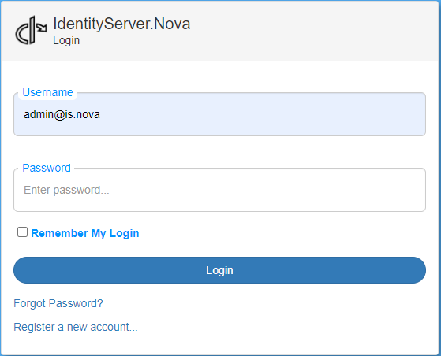

Als Administrator anmelden
==========================

Nach dem ersten Start sollte die Konsolenausgabe überprüft werden:

.. code-block:: bash

    [09:29:58 Information]
    Starting host...

    Using config file: _config/default.identityserver.net.json (not exist)
    ################# Setup ##################
    ISigningCredentialCertificateStorage: IdentityServerNET.Services.SigningCredential.SigningCredentialCertificateInMemoryStorage
    IUserDbContext: IdentityServerNET.Services.DbContext.InMemoryUserDb
    IRoleDbContext: IdentityServerNET.Services.DbContext.InMemoryRoleDb
    IClientDbContext: IdentityServerNET.Services.DbContext.InMemoryClientDb
    IResourceDbContext: IdentityServerNET.Services.DbContext.InMemoryResourceDb
    User admin@is.net created
    Password: Ay!ql5@r=xc%xOvq
    #########################################
    [09:29:59 Information] IdentityServer4.Startup

Hier wird angezeigt, welches Konfigurationsfile verwendet wird. Im folgenden Beispiel wird der **IdentityServerNET** ohne ein vorhandenes 
Konfigurationsfile gestartet (``... not exist``). Das ist grundsätzlich möglich, und in diesem Fall werden Standardwerte für die Konfiguration verwendet.

.. note::

    Der Start ohne Konfiguration ist nur für Testzwecke empfohlen. Hier werden alle Zertifikate, Benutzer, Rollen, Clients usw. nur im Speicher 
    abgelegt (InMemory-Datenbanken). Wird die Anwendung neu gestartet, sind alle vorgenommenen Einstellungen verloren.

Im *Setup*-Block wird angezeigt, welche Datenbank-Instanzen verwendet werden. Folgende Datenbanken werden hier aufgelistet:

* **ISigningCredentialCertificateStorage:** Hier werden die Zertifikate abgelegt. Über diese Zertifikate wird eine Anmeldung möglich gemacht,
  und über die öffentlichen Schlüssel kann die Gültigkeit eines (JWT-)Tokens überprüft werden. Die notwendigen Schlüssel dafür werden 
  vom IdentityServer auch über diese URL bereitgestellt: https://my-identity-server-url/.well-known/openid-configuration/jwks

* **IUserDbContext:** Hier werden die Benutzer gespeichert.
* **IRoleDbContext:** Hier werden die (Benutzer-)Rollen gespeichert.
* **IClientDbContext:** Hier werden Clients gespeichert. Clients sind (Web-)Anwendungen, bei denen man sich über den **IdentityServer** anmelden kann.
* **IResourceDbContext:** Hier werden Ressourcen gespeichert. Diese repräsentieren die `scopes`, die Anwendungen bei der Anmeldung übergeben können.
  
Falls in der *User-Datenbank* noch kein Administrator angelegt wurde, wird ein solcher Benutzer beim Start automatisch erstellt (``User admin created``).
Das Passwort wird zufällig gewählt und in der Konsolenausgabe angezeigt.

.. note::

    Dieses Passwort sollte in produktiven Umgebungen nach dem ersten Start geändert werden. Weitere Schritte siehe unten.

Im Browser wird beim ersten Start Folgendes angezeigt:

Klickt man auf ``Login``, kann man sich mit dem Benutzer ``admin`` und dem in der Konsolenausgabe angezeigten Passwort anmelden:

Nach erfolgreicher Anmeldung sieht die Anzeige in etwa wie folgt aus:

Administrator-Passwort ändern
-----------------------------

Das automatisch erstellte Administratorpasswort sollte in produktiven Umgebungen geändert werden. Dazu klickt man auf ``Manage my account``.

Hier können verschiedene Kontoeinstellungen vorgenommen werden. Zum Ändern des Passworts klickt man auf den Menüpunkt ``Passwort``. Hier 
muss noch einmal das aktuelle Passwort angegeben werden (`Current password`). Das neue Passwort muss zweimal eingegeben werden (`New password`, `Confirm new password`).

.. image:: img/login-as-admin4.png

Mit ``Update password`` wird das neue Passwort für zukünftige Anmeldungen festgelegt.

Zwei-Faktor-Authentifizierung
-----------------------------

Zur besseren Absicherung des Kontos ist eine Authentifizierung mit einem zweiten Faktor erforderlich (über eine **Authenticator App**). Für den Administrator wird dies empfohlen. 
Dazu klickt man auf ``Two-factor authentication`` und dort auf ``Setup authenticator app``:

.. image:: img/login-as-admin5.png

In einer **Authenticator App** kann der hier angezeigte QR-Code gescannt werden. Danach ist der erzeugte Code im Feld ``Verification Code`` einzugeben und mit ``Verify``
zu bestätigen.

Wird der ``Code`` akzeptiert, erscheint eine Anzeige mit möglichen ``Recovery codes``. Diese können anstelle der **Authenticator App** verwendet werden. Jeder dieser 
``Recovery Codes`` kann nur einmal für die Anmeldung verwendet werden:

Meldet man sich jetzt vom **IdentityServerNET** ab (``Logout``) und erneut an, muss neben dem neuen Passwort auch ein ``Authenticator code`` eingegeben werden:

.. image:: img/login-as-admin7.png

Hat man die **Authenticator App** nicht zur Verfügung, besteht noch die Möglichkeit, sich mit einem der ``Recovery Codes`` anzumelden. Dazu klickt man auf den Link ``log in with recovery code``:

.. image:: img/login-as-admin8.png
