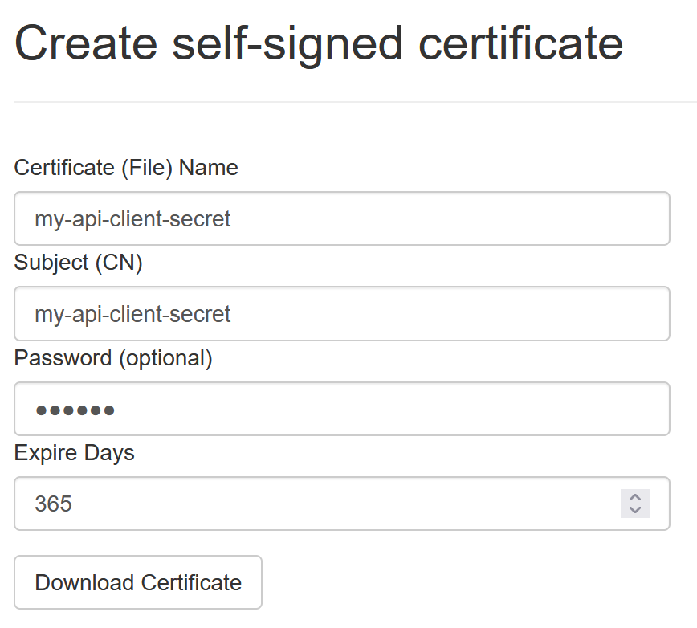
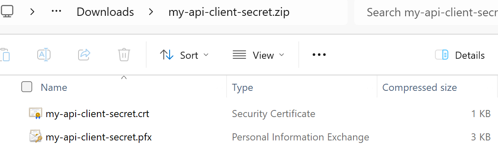

Creating Self-Signed Certificates
=================================

**IdentityServerNET** provides an *admin tool* to create self-signed certificates. The result is a *ZIP file* with the following content:

* **{cert-name}.pfx:** The certificate as a PFX file
* **{cert-name}.crt:** The public key of the certificate as a CRT file

.. note::

    CRT files can be opened in a text editor and have the following format:

    .. code::

        -----BEGIN CERTIFICATE-----
        MIICsDCCAZigAwIBAgIIHFgs7XAI8jgwDQYJKoZIhvcNAQELBQAwGDEWMBQGA1UEAxMNY2xpZW50
        LXNlY3JldDAeFw0yNDA4MjMwNTA0NThaFw0yNTA4MjMwNTA0NThaMBgxFjAUBgNVBAMTDWNsaWVu
        ...
        -----END CERTIFICATE-----

One common use of a self-signed certificate is as a **secret** for **clients**.

To create a certificate, go to the ``Create Certs`` section on the *Admin page*:

* **Certificate (File) Name:** A name for the certificate. This corresponds to the ZIP file 
  name and the names of the individual files.

* **Subject (CN):** The subject of the certificate (CN=...). This name appears in the certificate.

* **Password:** An optional password for the certificate. The PFX file can only be opened 
  with this password.

* **Expire Days:** The number of days after which the certificate expires.

Clicking on ``Download Certificate`` downloads a ZIP file with the following content:

