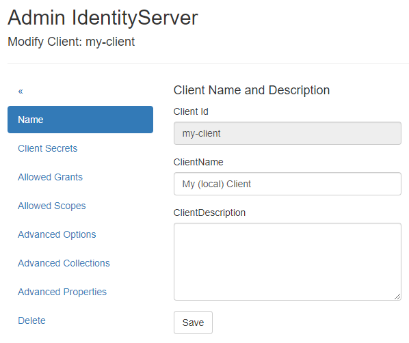
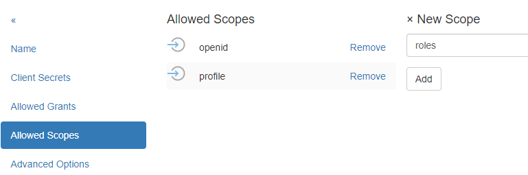
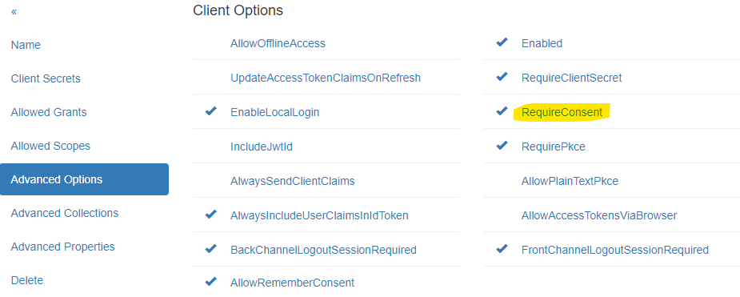

Web Application
===============

Creating/Editing a Client
-------------------------

To create a new *client*, a unique *Client Id* must be assigned. 
An optional display name can also be provided.

To simplify input, the ``WebApplication`` template should be selected. 
Additionally, the URL to the web application should be entered for this template. Specifying **scopes** is optional and 
can also be done in the next step.

Use ``Create new client...`` to create the new client:

.. image:: img/webapp1.png

After successfully creating the client, you will be taken to the ``Modify Client: ...`` page. 
The various client properties are organized into menu items:

``Name``:
+++++++++

Here, you can change the client’s display name and add a description.

``Client Secrets``:
+++++++++++++++++++

A client should also have a **secret**. The client application must send this **secret** when logging in. A **secret** can be either 
a text-based **Shared Secret** or a **certificate** (**X509 Certificate *.crt**). A **shared secret** can also be stored in the **Secrets Vault** (see later).

The **shared secret** can be any text, like a password. If you want a secure **secret**, you can use the ``Random Secret Generator`` on this page.

.. note:: 

    A **secret** can also have an expiration date (``Optional Expiration Date``) and a description.

The **secret** should be secure. For simplicity in this example, we will use the value ``secret`` without an expiration date:

.. note::

    Multiple **secrets** can be created. The client must then pass exactly one *valid* **secret**. This is useful if a **secret** needs to be rotated.
    The new **secret** can coexist with the old **secret** until all clients switch to the new **secret**. Only then should the old **secret** be deleted.

``Allowed Grants``:
+++++++++++++++++++

This section allows you to set the **grants** permitted for login. Each login method uses different **grants**. Since the ``WebApplication`` 
template was selected when creating the client, the appropriate **grants** should already be set here:

``Allowed Scopes``:
+++++++++++++++++++

**Scopes** specify which **identity resources** the web application can request for a logged-in user. Only **scopes** configured 
as **identity resources** in **IdentityServerNET** should be listed here (see section Getting Started).

For web applications, ``openid`` and ``profile`` are entered by default:

``Advanced Settings``:
++++++++++++++++++++++

Here, you can specify additional options for authentication. For example, you can specify whether a **secret** must always be provided by the client
(``RequireClientSecret``).
The ``RequireConsent`` option controls whether a user must consent after logging in to allow the web application access to the requested **scopes** (claims):

``Advanced Collections``:
+++++++++++++++++++++++++

Here, collections necessary for login can be specified. For web applications, it is essential to specify the URL to which a user is redirected after a successful login (``RedirectUri``).
To specify multiple URLs, enter each URL on a new line:

.. image:: img/webapp7.png

If a login request later comes from a page not listed here, **IdentityServerNET** will reject it.

``Advanced Properties``:
++++++++++++++++++++++++

Advanced settings for the client, such as ``IdentityTokenLifetime`` and ``AccessTokenLifetime``. These values generally do not need to be changed.

``Delete``:
+++++++++++

Here, you can delete a client.

Adjusting a Client Web Application
----------------------------------

A client must support **OpenId Connect**. In the ASP.NET Core environment, the necessary methods are available.

**IdentityServerNET** provides a straightforward approach via extension methods for the ``IServiceCollection`` object. The following **NuGet** package must be installed:

.. code:: powershell

    dotnet add package IdentityServerNET.Extensions.DependencyInjection

This package adds the following method to ``IServiceCollection``:

.. code:: csharp
    
    using IdentityServerNET.Extensions.DependencyInjection;

    var builder = WebApplication.CreateBuilder(args);

    // ...

    builder.Services.OpenIdConnectAuthentication(builder.Configuration);

The method retrieves parameters from the app configuration (e.g., ``appsettings.json``). The configuration must contain a
section ``OpenIdConnectAuthentication`` with the required parameters.

.. note::

    The section name can also be changed. In that case, the appropriate section should be passed instead of ``OpenIdConnectAuthentication``.

.. code:: json

    {
        // ...
        "OpenIdConnectAuthentication": {
            "Authority": "https://localhost:44300",
            "ClientId": "my-client",
            "ClientSecret": "secret",
            "Scopes": "openid,profile"
        }
    }

