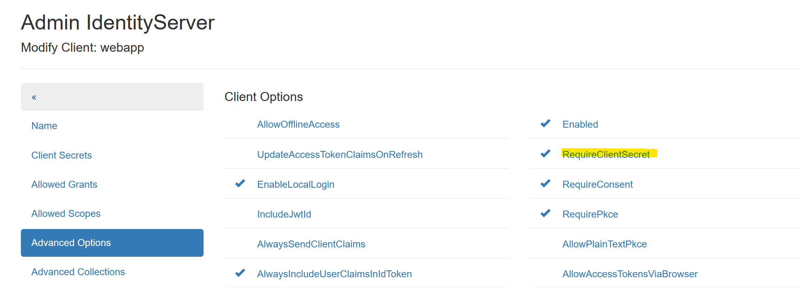

Secrets
=======

To obtain *Access Tokens*, a **Client** must, or should, provide a **Client Id** and a 
**Client Secret** (**Client Id** and **Client Secret** are roughly equivalent to 
*username* and *password*).

The different types of **secrets** are described here.

Using No Secret
---------------

**Clients** can be configured to require no **Secret**. In the ``Advanced Options`` menu of a **Client**, 
the following option is available:

If the option ``RequireClientSecret`` is not set, a **Client** does not need to provide a Secret.

.. note::

    Not setting this option should only be done for ``Web Applications``. In this case, 
    ``Redirect Urls`` can be added under the ``Advanced Collections`` menu:

    .. image:: img/secrets2.png

    Since the login process in *OpenId Connect* is only possible if it can redirect to one of these URLs,
    a **Web Application Client** is essentially secure. 

.. note::

    **API Clients** should never be allowed to retrieve an AccessToken without a **Secret**!

Shared Secrets
--------------

The simplest type of secrets are ``Shared Secrets``, which are essentially 
passwords (text):

.. image:: img/secrets3.png

.. note::

    Multiple **Secrets** can be specified for a **Client**. A **Client** must provide 
    exactly one matching **Secret** from those listed here.

.. note::

    **Secrets** can have an expiration date (``optional: Expire Date``). This can be useful 
    if a client should only have access to an API for a limited time.

To create secure **Secrets**, you can use the ``Random Secret Generator`` 
provided on the page:

.. image:: img/secrets4.png
    :width: 320

The generated password can be copied from the text field and pasted into the 
``Shared Secret`` input field.

X509 Certificate
----------------

**Clients** can also be secured with certificates. Self-signed certificates, as described in the previous section, can be used for this.

To secure a **Client** with a certificate, the following files are required:

* **PFX file:** Contains the public and private keys and can optionally be protected with a 
  password. This certificate is used by the **Client** to retrieve an *AccessToken*.

* **CRT file:** Public key (text format). This certificate is stored on the 
  *IdentityServerNET* as a **Secret**.

.. image:: img/secrets5.png

The *CRT file* must be opened with a text editor, and the contents copied into the input field.
Set the **Secret** type to ``X509 Certificate (.crt)``.

Client Access
+++++++++++++

A **Client** must first read the certificate:

.. code:: csharp

    var cert = new X509Certificate2(@"my-api-client-secret.pfx", "password");

This certificate can then be passed to various methods from the **NuGet** package 
``IdentityServerNET.Clients`` instead of a *Shared Secret*.

.. code:: csharp

    var tokenClient = new IdentityServerNET.Clients.TokenClient("my-api-commands", cert);
    await tokenClient.GetAccessToken("https://localhost:44300", []);

    var accessToken = tokenClient.AccessToken;

Secrets Vault
-------------

In the **Secrets Vault** (see previous section), **Secrets** can be stored centrally.
Authorized **Clients** can retrieve **Secrets** through the **Secret Value API**.

To avoid maintaining **Secrets** in multiple places, **Secrets** for **Clients** can be set to point 
directly to the **Secrets Vault**. If a **Secret** is changed in the **Secrets Vault**, it does not 
need to be updated again under the **Client's Secrets**.

Instead of the actual **Secret**, the *path* of the **Secret** in the **Secrets Vault** is entered:

.. image:: img/secrets6.png

To find the path for a Secret, navigate to the **Secrets Vault** as an administrator and click on the 
desired version of a **Secret**. The browser will display a JSON, which includes the correct path for the **Secret**:

.. image:: img/secrets7.png

.. note::

    Either a specific version or the latest created version of a Secret can be referenced 
    in the path. To reference the latest version, omit the version number from the path, e.g.: 
    ``my-api-locker/db-connectionstring``

Client Access
+++++++++++++

Access to the **Secrets Vault** was already described in the *Secrets Vault* chapter. 
Here is the example again, assuming the **API Client** is secured for the **Secrets Vault API** with a certificate.

A **Client** must first read the certificate:

.. code:: csharp

    var cert = new X509Certificate2(@"my-api-client-secret.pfx", "password");

This certificate can then be passed to various methods from the **NuGet** package 
``IdentityServerNET.Clients`` instead of a *Shared Secret*.

.. code:: csharp

    var secretsVaultClient = new IdentityServerNET.Clients.SecretsVaultClient("my-api-secrets", cert);
    await secretsVaultClient.OpenLocker("https://localhost:44300", "my-api-locker");
    var secretResponse = await secretsVaultClient.GetSecret("db-connectionstring");

    Console.WriteLine(secretResponse.GetValue());

In this way, a **Client application** can be developed where no sensitive data is stored in the configuration. 
All **Secrets** are stored in the **Secrets Vault**. The only secret required for the client is the optional 
certificate password (this can theoretically be hardcoded).

The certificate can be rotated regularly by following these steps:

* Create a new certificate (possibly with the same password).

* Update the content of the CRT file for the **Secrets Vault Client**.

* Update the PFX file for the **Client application**.
