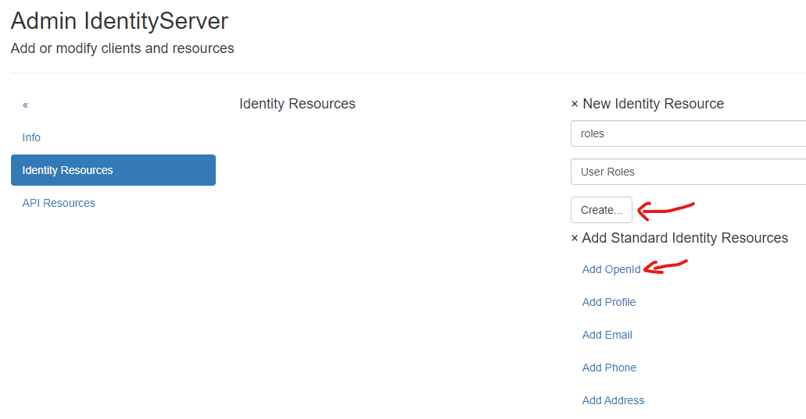
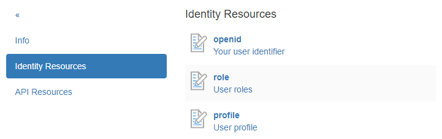

Server Administration
=====================

.. note::

    This section only explains basic administration; specific topics (such as registering a web application as a client, etc.) will be discussed in more detail later.
    Additionally, not every administration page is covered here (e.g., ``User/Set Password``, ``User/Delete User``), as these should be self-explanatory.

When logged in as an administrator, click on the ``Admin`` tile on the homepage to access the following view:

.. image:: img/admin-server1.png

User
----

Clicking on the ``User`` tile displays the following view:

.. image:: img/admin-server2.png

.. note::

    You can always return to the previous view by clicking the ``«`` icon in the menu.

.. note::

    If many users have already been created, the list can be filtered. Enter a filter (e.g., ``admin``) under ``Filter users...`` and click on ``Set Filter``. This will display only users with ``admin`` in their name. Clearing the input field and clicking ``Set Filter`` again will display all users.

Here, you can manage properties from a user’s profile (password, name, roles) by clicking on a user in the list.
You can also create a new user by clicking `Create new user`.

.. note::

    It is recommended to always use an email address as the username here. This should generally be unique.

    If the username is an email address, it should usually be confirmed upon user registration. In the test environment, 
    the administrator can bypass this step and mark the email address as confirmed:

    .. image:: img/admin-server3.png

    A future login with this user is possible once the email address is marked as ``confirmed``!

Roles
-----

Clicking on the ``Roles`` tile takes you to the following view:

.. image:: img/admin-server4.png

Here, you can manage roles that can be assigned to users. By default, roles from **IdentityServerNET** are listed here, indicating whether a user
is authorized to perform certain administrative tasks. Custom roles can be created in the ``Create new role`` section.

By clicking on a role in the list, various attributes (such as the description) can be modified, or the role can be deleted.

Additionally, users can be assigned to or removed from a role here:

.. image:: img/admin-server5.png

Resources (Identities & APIs)
-----------------------------

Clicking on the ``Resources (Identities & APIs)`` tile brings you to a view explaining ``Identity Resources`` and ``Api Resources``.

Initially, the focus is on ``Identity Resources``, which specify the ``Claims`` a client (web) application can request during login. 
The settings here apply to the entire server and specify what may be available. Later, when setting up a client, you will specify 
which ``Claims`` a particular application can request (``Scopes``), with only the ``Identity Resources`` indicated here being available.

Navigating to ``Identity Resources`` shows the following view:

Here, you can create new *Identity Resources* or add *Standard Identity Resources*. For the initial setup, it is recommended to add 
the *Standard Identity Resources* ``OpenId`` and ``Profile``. If a client application later needs to view the ``Roles`` of the logged-in user,
a custom *Identity Resource* ``role`` can also be created:

By clicking on an *Identity Resource*, additional details can be specified, such as the name of the ``Claim``:

.. image:: img/admin-server8.png

.. note::

    For custom *Identity Resources*, this page opens during creation. Here, a ``Claim`` name must always be assigned first.