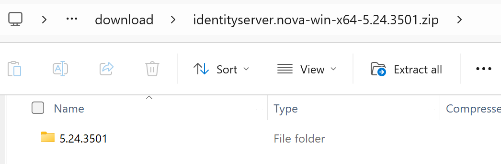

Installation on Windows
=======================

.. note::

    ASP.NET Core 8.0 must be installed. Running ``dotnet --info`` in a *command prompt*
    should display the following framework in the output:

    .. code::

        .NET runtimes installed:
        Microsoft.AspNetCore.App 8.0.x [/usr/lib/dotnet/shared/Microsoft.AspNetCore.App]
        Microsoft.NETCore.App 8.0.x [/usr/lib/dotnet/shared/Microsoft.NETCore.App]

For Windows, ZIP files named ``identityservernet-win-x64-{version}.zip`` are available under `Releases <https://github.com/jugstalt/IdentityServerNET/releases>`_.

The ZIP file contains a folder named after the version number:

This folder can be copied to any location, for example, ``C:\apps\identityserver-net``. Inside the folder, you will find the application itself
(in the ``app`` directory) as well as a **bat file** to start the application:

Starting the Application Locally
--------------------------------

You can start the application locally using the **bat file** ``start-with-dev-https.bat``.
The application will then be accessible at http://localhost:8080 and https://localhost:8443.

.. code::

    cd .\app
    dotnet IdentityServer.dll --customAppSettings=dev-https

.. note::

    The server is started with ``--customAppSettings=dev-https`` to load the additional 
    configuration ``appsettings.dev-https.json``, which specifies ports and a 
    developer certificate for the HTTPS connection.

For HTTPS, only a developer certificate is used. Since this certificate is not 
signed by a trusted authority, the browser may display a warning 
(„not secure …“) that can safely be ignored.

Integrating the Application in IIS
----------------------------------

To integrate the application in IIS, first create an ``ApplicationPool``:

.. image:: img/install-windows3.png
    :width: 320

Using this **Application Pool**, you can now create a new **web application**.
The physical path should be the ``app`` directory:

.. image:: img/install-windows4.png
    :width: 400
