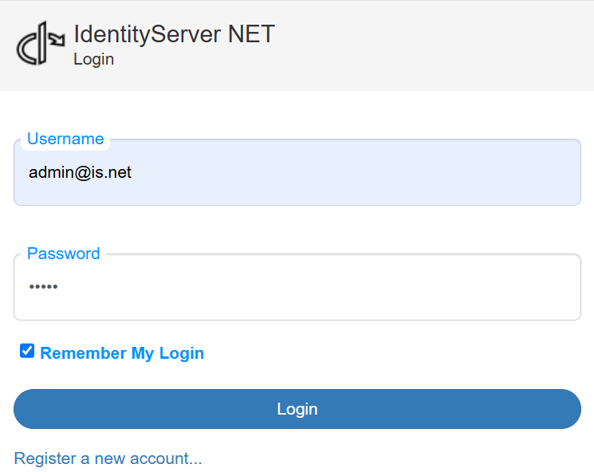

Log in as Administrator
=======================

After the initial startup, the console output should be checked:

.. code-block:: bash

    [09:29:58 Information]
    Starting host...

    Using config file: _config/default.identityserver.net.json (not exist)
    ################# Setup ##################
    ISigningCredentialCertificateStorage: IdentityServerNET.Services.SigningCredential.SigningCredentialCertificateInMemoryStorage
    IUserDbContext: IdentityServerNET.Services.DbContext.InMemoryUserDb
    IRoleDbContext: IdentityServerNET.Services.DbContext.InMemoryRoleDb
    IClientDbContext: IdentityServerNET.Services.DbContext.InMemoryClientDb
    IResourceDbContext: IdentityServerNET.Services.DbContext.InMemoryResourceDb
    User admin@is.net created
    Password: Ay!ql5@r=xc%xOvq
    #########################################
    [09:29:59 Information] IdentityServer4.Startup

This displays the configuration file in use. In the example shown, **IdentityServerNET** starts without an existing 
configuration file (``... not exist``). This is generally possible, and in such cases, default configuration values are used.

.. note::

    Starting without a configuration file is recommended only for testing. Here, all certificates, users, roles, clients, etc., are stored 
    only in memory (InMemory databases). If the application restarts, all settings made will be lost.

In the *Setup* block, the database instances in use are shown. The following databases are listed here:

* **ISigningCredentialCertificateStorage:** Certificates are stored here. These certificates enable user login,
  and with their public keys, the validity of a (JWT) token can be verified. The necessary keys for this are also provided by IdentityServer at this URL: https://my-identity-server-url/.well-known/openid-configuration/jwks

* **IUserDbContext:** Stores users.
* **IRoleDbContext:** Stores user roles.
* **IClientDbContext:** Stores clients, which are (web) applications where users can log in via the **IdentityServer**.
* **IResourceDbContext:** Stores resources. These represent the `scopes` that applications can pass during login.
  
If no administrator has been set up in the *User Database*, one is automatically created at startup (``User admin created``).
The password is randomly generated and displayed in the console output.

.. note::

    In production environments, this password should be changed after the initial startup. See further steps below.

At the first startup, the following is displayed in the browser:

Clicking on ``Login`` allows you to log in as the ``admin`` user with the password displayed in the console output:

After a successful login, the display will look something like this:

Changing the Administrator Password
-----------------------------------

The automatically generated administrator password should be changed in production environments. Click on ``Manage my account`` to do this.

Here, various account settings can be made. To change the password, click on ``Password``. The current password must be re-entered (`Current password`). 
The new password must be entered twice (`New password`, `Confirm new password`).

.. image:: img/login-as-admin4.png

Clicking ``Update password`` sets the new password for future logins.

Two-Factor Authentication
-------------------------

For better account security, two-factor authentication via an **Authenticator App** is recommended, especially for the administrator. 
To set this up, click on ``Two-factor authentication`` and then ``Setup authenticator app``:

.. image:: img/login-as-admin5.png

In an **Authenticator App**, scan the QR code displayed here. Enter the generated code in the ``Verification Code`` field and confirm with ``Verify``.

If the ``Code`` is accepted, a display with ``Recovery codes`` appears. These can be used as an alternative to the **Authenticator App**. Each 
``Recovery Code`` can only be used once to log in:

.. image:: img/login-as-admin6.png

When logging out (``Logout``) of **IdentityServerNET** and logging back in, you will now need to enter an ``Authenticator code`` in addition to the new password:

If the **Authenticator App** is unavailable, you can still log in with one of the ``Recovery Codes`` by clicking the ``log in with recovery code`` link:

.. image:: img/login-as-admin8.png

